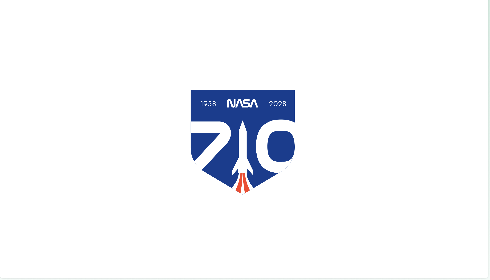
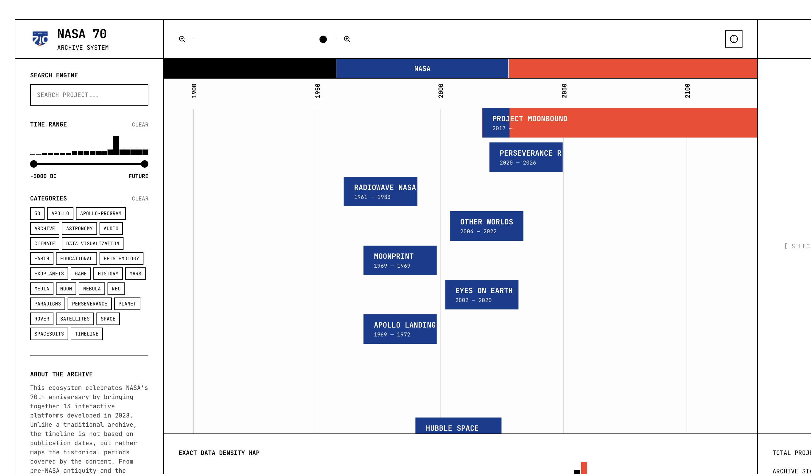
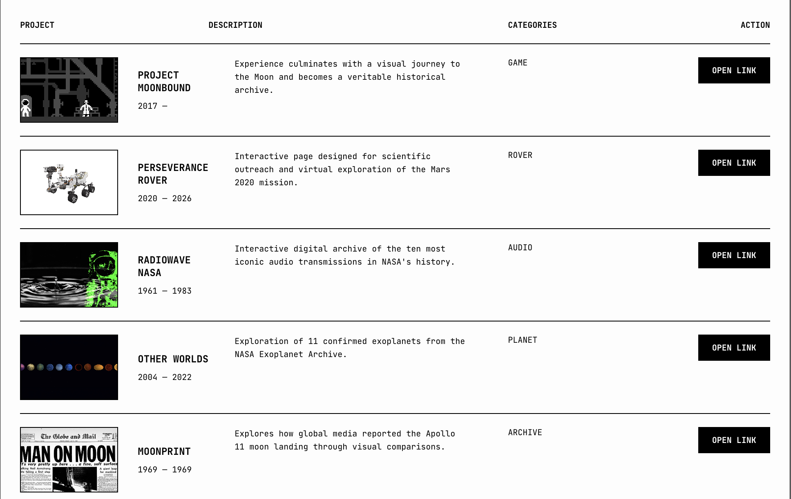
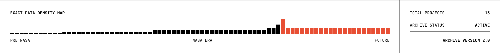

SUPSI 2026  
Corso d’interaction design, CV429.01  
Docenti: A. Gysin, G. Profeta  

Progetto 2: La conquista dello spazio

# NASA 70 — Precision Data Archive
Autore: Michelle Chicherio \
[NASA 70 — Precision Data Archive](https://kikerio.github.io/nasa70-archive/)


## Introduzione e tema
Sviluppato in occasione del 70° anniversario della NASA, "NASA 70 — Precision Data Archive" è un ecosistema digitale e meta-archivio progettato per ospitare, organizzare e mappare le 13 piattaforme interattive sviluppate durante l'anno accademico. Il progetto si propone di rivoluzionare radicalmente la classica visualizzazione statica degli archivi digitali a elenco. L'approccio tematico e d'interazione sposta il baricentro cronologico: i lavori non vengono ordinati e catalogati in base alla loro data di pubblicazione o rilascio, ma vengono mappati storicamente sul piano della linea temporale in base al reale contenuto scientifico, culturale e storiografico approfondito al loro interno. L'asse temporale si estende così in modo immenso, coprendo un vettore temporale che spazia dall'antichità pre-NASA (-3000 AC) e dalle scoperte della Space Age, fino alle proiezioni speculative e infinite nel futuro (4000 DC).


## Riferimenti progettuali
Il progetto affonda le sue radici metodologiche ed estetiche nel Funzionalismo svizzero e nell'International Typographic Style. Il principale riferimento visivo e strutturale è la "Swiss Grid", una griglia geometrica assoluta e inflessibile che organizza lo spazio riducendo al minimo la componente decorativa a favore della massima precisione informativa. La scelta tipografica del carattere monospaziato *JetBrains Mono* risponde alla necessità di evocare l'estetica dei terminali di calcolo, dei tabulati di dati scientifici e dei sistemi di programmazione puri della NASA. Dal punto di vista teorico, la catalogazione e la scomposizione analitica dei metadati si ispirano ai sistemi di progettazione di Karl Gerstner e ai manuali di coordinamento visivo di Massimo Vignelli, dove la struttura modulare diventa essa stessa interfaccia, permettendo la visualizzazione istantanea della densità dei dati senza filtri morfologici complessi.


## Design dell’interfaccia e modalità di interazione
L'interfaccia si sviluppa attraverso un layout a schermo intero rigido e geometrico, interamente confinato e strutturato da una cornice nera perimetrale e da linee di divisione nette che ricalcano la partizione dello spazio di lavoro. L'esperienza utente si apre con un caricatore ad alto impatto visivo (*preloader*) che scompone e ricompone cinematicamente i vettori geometrici del logo celebrativo della NASA (il razzo, la silhouette dello scudo, le date e le cifre del 70°).

L'architettura dell'interfaccia si articola in quattro macro-aree interconnesse in tempo reale:
1. **Sidebar di Controllo (Filtri Sfaccettati):** Posizionata a sinistra, ospita il motore di ricerca testuale istantaneo, un filtro temporale avanzato in stile "booking" dotato di doppio cursore di selezione accoppiato a un istogramma di distribuzione, e una matrice di tag-pulsanti per il filtraggio categoriale rapido.
2. **Main View Viewport (Dual-Mode):** L'area centrale permette di alternare due modalità di visualizzazione dei dati. La *Timeline View* mostra i progetti distribuiti su corsie orizzontali e rappresentati tramite barre vettoriali configurate con gradienti cromatici svizzeri netti ad "hard stop", i cui colori codificano l'era di appartenenza (Pre-NASA in Nero, NASA Era in Blu `#0B3D91`, Future in Rosso `#FC3D21`). Uno slider di zoom iper-fluido permette di espandere o contrarre l'asse temporale ricalcolando dinamicamente la posizione dei righelli verticali. La *Table View* organizza invece i medesimi dati in una matrice tabellare pulita adatta a un'ispezione testuale analitica.
3. **Inspector Drawer Responsivo:** Posizionato a destra, agisce come un pannello informativo profondo. Al click su una barra della timeline o su una riga della tabella, il drawer si popola fluidamente applicando una transizione verticale d'ingresso e mostrando i metadati completi, la sinossi descrittiva, i tag di sistema, l'anteprima visiva del progetto e la *Call to Action* "OPEN LINK" per accedere all'applicazione esterna.
4. **Data Density Map (Footer):** La sezione inferiore calcola e visualizza in tempo reale un grafico della densità dei dati basato sul numero di progetti attivi per ciascun segmento temporale, offrendo una mappa visiva immediata di quali ere storiche siano state maggiormente investigate dai ricercatori.

<video src="assets/imgs/70_archive.mov" width="100%" controls></video>


!


## Tecnologia usata
La piattaforma è ingegnerizzata utilizzando un'architettura front-end standard, pulita e priva di sovrastrutture computazionali esterne. Il layout semantico è strutturato in HTML5 e stilizzato in CSS3 tramite un sistema rigoroso di CSS Variables per la gestione dei vettori spaziali di layout e dei codici colore istituzionali. La logica matematica di posizionamento spaziale, la gestione dello zoom dinamico del viewport e il motore di filtraggio combinatorio sincrono (testo + intervallo temporale + categorie) sono scritti in JavaScript nativo, supportati dall'integrazione di *Lucide Icons* per la gestione della libreria di icone vettoriali. Il database dell'archivio è memorizzato in un array JSON immutabile composto da oggetti strutturati; una funzione di mappatura matematica traduce gli anni di inizio e fine dei progetti in coordinate pixel precise sul piano cartesiano (`getX()`), calcolando in tempo reale le sfumature e le collisioni di layout all'interno del DOM.

```JavaScript
// CONFIGURAZIONE APPLICATIVA DEL TARGET E DEL CONTESTO D'USO
const ARCHIVE_SETTINGS = {
    contextMode: "PRODUCTION_DASHBOARD",   // Interfaccia analitica ad alta densità informativa
    targetAudience: "DESIGNERS_RESEARCHERS", // Target: Professionisti, designer e istituzioni accademiche
    coordinateSpace: {
        startYear: -3000,
        endYear: 4000,
        totalSpan: 7000
    }
};

// Funzione matematica di mappatura temporale e rendering dei gradienti ad hard-stop svizzeri
function getFluidGradient(p) {
    const cPre = '#000000'; 
    const cNasa = '#0B3D91'; 
    const cFuture = '#FC3D21';
    
    if (p.endYear <= 1958) return cPre;
    if (p.startYear >= 1958 && p.endYear <= 2028) return cNasa;
    if (p.startYear >= 2028) return cFuture;

    let span = p.endYear - p.startYear; 
    if (span === 0) span = 1;
    let stops = [];
    
    if (p.startYear < 1958) stops.push(`${cPre} 0%`);
    else if (p.startYear >= 1958 && p.startYear < 2028) stops.push(`${cNasa} 0%`);
    else stops.push(`${cFuture} 0%`);

    if (p.startYear < 1958 && p.endYear > 1958) {
        let perc = ((1958 - p.startYear) / span) * 100;
        stops.push(`${cPre} calc(${perc}% - 1px)`, `${cNasa} calc(${perc}% + 1px)`); 
    }
    
    if (p.startYear < 2028 && p.endYear > 2028) {
        let perc = ((2028 - p.startYear) / span) * 100;
        stops.push(`${cNasa} calc(${perc}% - 1px)`, `${cFuture} calc(${perc}% + 1px)`);
    }

    if (p.endYear <= 1958) stops.push(`${cPre} 100%`);
    else if (p.endYear <= 2028) stops.push(`${cNasa} 100%`);
    else stops.push(`${cFuture} 100%`);

    return `linear-gradient(to right, ${stops.join(', ')})`;
}

// Calcolo deterministico della posizione X sul piano cartesiano della timeline
function getX(year) { 
    const paddingGlobal = 24;
    const timeSpan = ARCHIVE_SETTINGS.coordinateSpace.totalSpan;
    const origin = ARCHIVE_SETTINGS.coordinateSpace.startYear;
    return (((year - origin) / timeSpan) * currentTotalWidth) + paddingGlobal; 
}
```


## Target e contesto d’uso
Il target di riferimento è altamente specialistico ed è focalizzato su ricercatori scientifici, interaction designer, studenti accademici e professionisti della comunicazione visiva interessati a comprendere la complessità dei progetti spaziali correlati alla NASA. L'ecosistema è ottimizzato per una fruizione desktop ad alta concentrazione di dati, configurandosi come uno strumento di lavoro, consultazione e analisi comparativa. Trova la sua perfetta collocazione all'interno di laboratori di design, portali istituzionali di archiviazione accademica o postazioni di lavoro dedicate all'analisi di sistemi informativi complessi (*Information Visualization*).
